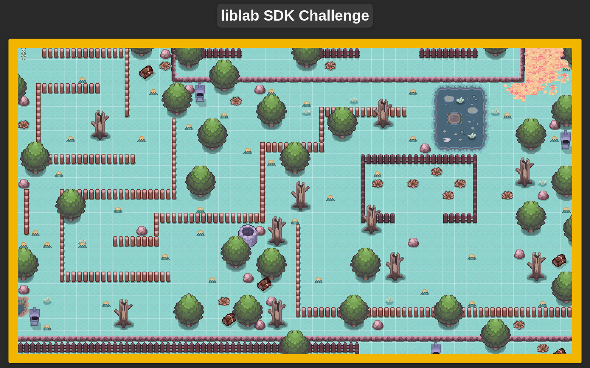

# Llama Game SDK Tutorial

## Overview
Welcome to this hands-on tutorial on how to use Liblab to generate an SDK for the Llama Game. This tutorial uses Liblab, a platform designed for creating SDKs from API specifications, enabling developers to integrate applications more efficiently. The game's aim is to guide a llama through a maze using the SDK we generate.

   

## Prerequisites
- An existing Liblab account ([sign up here](https://developers.liblab.com))
- Docker installed on your machine
- Node.js and NPM (comes with Node.js) installed

## Tutorial Instructions

### Setting Up Your Environment
1. Clone the Llama game demo repository:
   ```bash
   git clone https://github.com/liblaber/llama-game-demo.git
   cd llama-game-demo
   ```
   This step downloads the game files to your local machine and navigates into the project directory.

2. Install TypeScript and Phaser:
   ```bash
   npm install -g typescript
   npm install phaser
   ```
   TypeScript is needed to compile the game's source code, while Phaser is the game framework used for this project.

3. Transpile the frontend and build assets:
   ```bash
   cd frontend
   npm run build
   ```
   This command compiles the TypeScript code and bundles the game assets, preparing them for use.

### Running the Llama Game
1. From the root directory of the project, start the Docker container:
   ```bash
   docker-compose up --build
   ```
   This command builds the Docker image and starts the container. You should see output indicating that the server is running.

2. Open [localhost:8000](http://localhost:8000) in your web browser to access the Llama Game interface. You should see the game loaded successfully.

   

3. Keep the Docker container running as the game needs to be active for the next steps.

Note: The Docker setup ensures all dependencies are correctly installed and the environment is consistent across different systems.

Note: The Docker setup ensures all dependencies are correctly installed and the environment is consistent across different systems.

### Using Liblab for SDK Generation
1. Install the Liblab CLI:
   ```bash
   npm install -g liblab
   ```
2. Login using your Liblab credentials:
   ```bash
   liblab login
   ```

   Follow the prompts to enter your email and password. If you don't have an account, you'll be guided through the signup process.

3. Initialize and configure Liblab for SDK generation:
   ```bash
   liblab init
   ```
   This command will create a `liblab.config.json` file in your current directory. Open this file in a text editor and modify its contents to match the following:

   ```json
   {
     "sdkName": "llama-game",
     "specFilePath": "http://localhost:8000/openapi.json",
     "languages": [
       "python"
     ],
     "createDocs": true,
     "customizations": {
       "devContainer": true
     }
   }
   ```

   This configuration specifies the SDK name, the location of the API specification, the programming language for the SDK (Python in this case), and enables documentation creation. You can modify the `languages` array to include other programming languages if desired.

4. Generate the SDK using the following command:
   ```bash
   liblab build
   ```
   This process may take a few minutes. Once completed, you'll find your generated SDK in the `output` directory. The SDK will be in a subfolder corresponding to the language(s) specified in your `liblab.config.json` file.

5. Review the generated SDK and its documentation. You can now use this SDK to control your llama in the game! Here's how to get started:

a. Create the llama game SDK client:
   - Import necessary classes and enums from the generated SDK.
   - Initialize the `LlamaGameSDK` client with required parameters:
     - `access_token`: Your API authentication token.
     - `base_url`: The API endpoint URL (using the default environment).
     - `timeout`: Maximum time (in milliseconds) to wait for API responses.

b. Create a llama:
   - Use the `sdk.llamas.create_llama()` method to create a new llama.
   - Specify the llama's name and color using the `LlamaColor` enum.
   - Store the returned llama object, particularly its `id` for future operations.

c. Add steps for the llama to reach the pen:
   - Define a list of steps, where each step is a dictionary containing:
     - `direction`: Use the `Direction` enum to specify movement direction.
     - `steps`: Integer value for the number of steps in that direction.
   - Iterate through the steps list.
   - For each step, call `sdk.llamas.add_step()` method with:
     - `llama_id`: The ID of the llama to move.
     - `direction`: The direction from the current step.
     - `steps`: The number of steps from the current step.

d. Run the steps to move the llama:
   - Call the `sdk.llamas.move_llama()` method with the llama's ID.
   - This executes all previously added steps for the specified llama.
   - Store the returned result object for analysis.

e. Output the result:
   - The `result` object contains information about the llama's movement:
     - `final_position`: A tuple or object representing the llama's end coordinates.
     - `score`: An integer or float representing the game score.
     - `status`: A string or enum indicating the game status (e.g., success, failure).
   - Print these values to review the outcome of the llama's movement.

Refer to the generated SDK documentation for detailed information on how to implement these steps in your chosen programming language.

## Conclusion
This guide demonstrated the capabilities of Liblab for SDK generation, specifically applied to an interactive gaming scenario. By leveraging Liblab, you can efficiently create SDKs from well-defined API specifications, streamlining the development process for various projects.

The benefits of using Liblab for SDK generation include:
- Automated code generation across multiple programming languages
- Consistent SDK behavior and structure
- Easy updates as your API evolves
- Customization options to fit specific project requirements

To learn more about Liblab and SDK generation, check out these resources:
- [Liblab Documentation](https://developers.liblab.com)
- [Liblab Blog](https://blog.liblab.com)
- [Join Liblab Discord Community](https://discord.gg/F8aECHbRkV)

Continue exploring Liblab's features to enhance your API integration and SDK distribution strategies!
